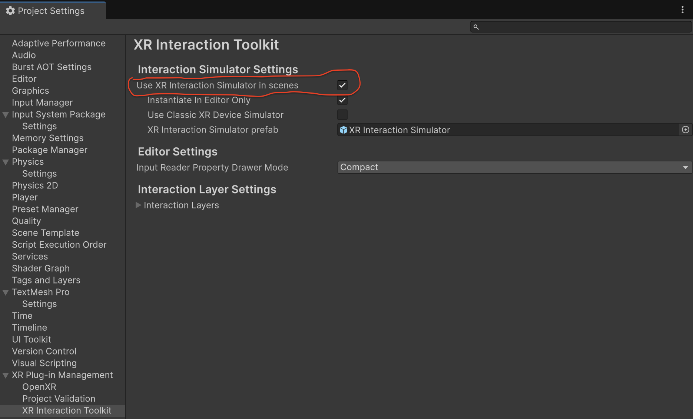

# beat-weight
Love doing **bicep curls** and playing in **VR**? Then you’ve come to the right place!

## Table of Contents
- [Overview](#overview)
- [Tech Stack](#tech-stack)
- [Getting Started](#getting-started)
    - [Requirements](#requirements)
        - [Software Requirements](#software-requirements)
        - [Hardware Requirements](#hardware-requirements)
        - [VR Requirements](#vr-requirements)
    - [Running the Project](#running-the-project)
    - [Replayability](#replayability)
    <!-- - [Running the Build](#running-the-build) -->
- [Attributions](#attributions)
- [License](#license)
- [Showcase](#showcase)
- [Contributors](#contributors)
    - [Development Team](#development-team)
    - [Supervisors](#supervisors)

## Overview
**Beat Weights** is a VR exergame that integrates rhythmic interaction and strength training to enhance user engagement in strength training. Players perform bicep curls in sync with the music to earn points, improve their form, and stay motivated during workouts.  

Developed as part of a research project at the **University of Auckland**, **Beat Weights** explores how the combination of music and VR exergaming can influence strength training motivation and performance.

## Tech Stack
<p align="center">
    
</p>

## Getting Started
This section will guide you through setting up **Beat Weights**.

### Requirements
Please ensure the following requirements are met to run **Beat Weights** on your system.

#### Software Requirements 
- [Microsoft .NET Framework / C# Runtime](https://dotnet.microsoft.com/en-us/)
- [Unity 6.0](https://unity.com/download)
- [Meta Quest Link](https://www.meta.com/en-gb/help/quest/1517439565442928/)

#### Hardware Requirements
Unity’s VR support currently targets Windows-based PCs. Please ensure you have a capable Windows system that meets the **recommended** specifications:

- **Operating System:** Windows 10 (64-bits) or higher
- **RAM:** 16 GB (or more)
- **CPU:** AMD Ryzen 5 5600X (or better)
- **GPU:** NVIDIA GeForce RTX 3060 Ti GDDR6X (or better, and with at least 8 GB VRAM)
- **Storage:** 5 GB (or more)

> [!IMPORTANT]
> VR builds of Beat Weights are only supported on Windows due to Unity’s VR runtime limitations.

#### VR Requirements
Beat Weights is designed for VR headsets and controllers. During development, testing was conducted primarily on the Meta Quest Pro via Meta Link (OpenXR):

- VR Headset (e.g., Meta Quest Pro, Quest 2, etc.,)
- VR Motion Controllers (OpenXR compatible)

> [!NOTE]
> While Beat Weights was developed using the Meta Quest Pro, any OpenXR-compatible VR headset and controller should work.

### Running the Project
Once all requirements are met, follow these steps to run **Beat Weights**:

1. Clone the repository (skip this step if you downloaded the repository as a ZIP file):
```sh
git clone https://github.com/DuckyShine004/beat-weight.git
```

2. Open the project in **Unity 6.0** (or newer).
3. Connect your **VR headset** via **Meta Link (OpenXR)**.
4. In the Unity Editor, navigate to `Assets/Scenes/FinalScene` and ensure this scene is selected as the active scene. 
5. Press **Play** in the Unity Editor.


By default, Beat Weights runs assuming you have a VR setup. However, if you’d like to play the game using standard keyboard and mouse controls (via the **XR Interaction Simulator**), follow these steps:

1. Open **Project Settings** in Unity. 
2. Search for **"XR Interaction Toolkit"**.
3. Enable the option **"Use XR Interaction Simulator in Scenes"**.

Please refer to the image below for guidance:



### Replayability
To play the game again, please stop the game after the results are displayed, then press Play once more. Replayability was not part of the original game requirements, so restarting must be done manually.

## Attributions
All third-party assets, tools, and resources used in this project are properly credited in [`ATTRIBUTIONS.md`](./ATTRIBUTIONS.md).

## License
This project is licensed under the [MIT License](./LICENSE). See the `LICENSE` file for more details.

## Showcase

https://github.com/user-attachments/assets/1cdb5f2a-63a9-4180-94e7-0c1f195abf97

## Contributors

### Development Team
<table>
  <tr>
    <th colspan="3">Group 7</th>
  </tr>
  <tr>
    <th>Name</th>
    <th>UPI</th>
  </tr>
  <tr>
    <td>Gallon Zhou</td>
    <td>gzho038</td>
  </tr>
  <tr>
    <td>Benjamin Qian</td>
    <td>bqia247</td>
  </tr>
  <tr>
    <td>Nicholas Lianto</td>
    <td>nlia656</td>
  </tr>
  <tr>
    <td>Thisuka Matara Arachchige</td>
    <td>tmat871</td>
  </tr>
</table>

### Supervisors
| Name              | Contact |
|--------------------|---------------------------------------------|
| Burkhard Wuensche  | [burkhard@cs.auckland.ac.nz](mailto:burkhard@cs.auckland.ac.nz) |
| Zixuan Wang       | [zwan843@aucklanduni.ac.nz](mailto:zwan843@aucklanduni.ac.nz) |
